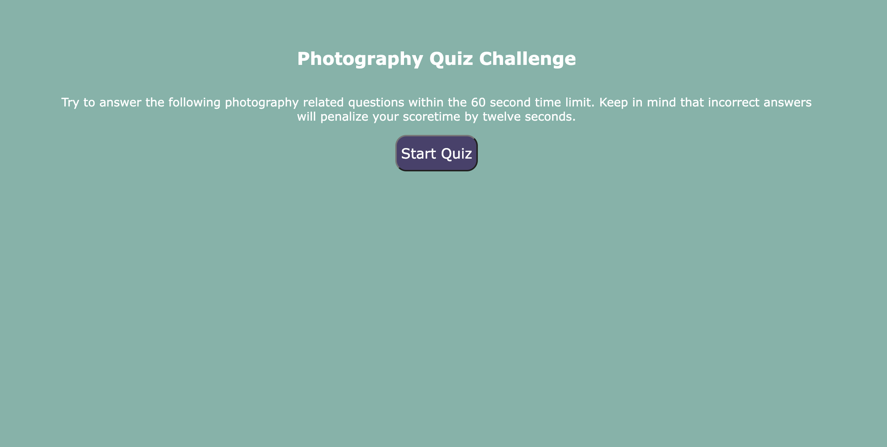
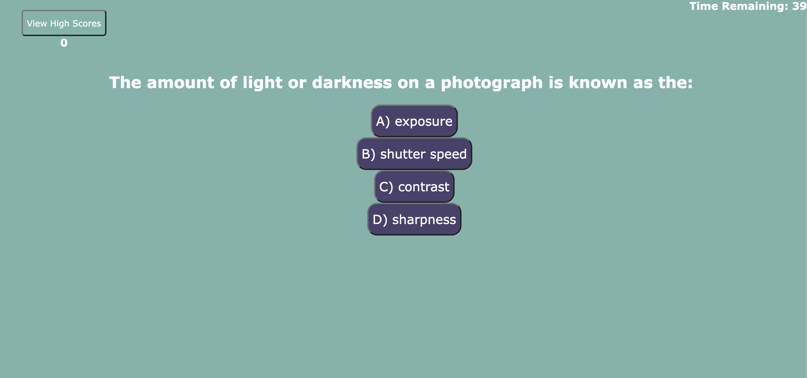

# take-a-quiz

## Description

### What was our motivation?

- I have been hired to build a photography assessment that includes multiple choice questions for a media company to use in their interview process. 

### Why did we build this project?

- I built this project to showcase my ability to use Web APIs to build a website. I was able to bring all of skills I have learned together on this project. 

### What did we learn? 

- In this project I learned how to create a quiz that includes multiple choice questions. I was able to use conditional statements, loops, and  web APIs to get this website working. 
    
 
## User Story
```
AS A photographer candidate
I WANT to take a timed quiz on photography fundamentals that stores high scores
SO THAT I can gauge my progress compared to my peers
```


## Acceptance Criteria
```
GIVEN I am taking a quiz
WHEN I click the start button
THEN a timer starts and I am presented with a question
WHEN I answer a question
THEN I am presented with another question
WHEN I answer a question incorrectly
THEN time is subtracted from the clock
WHEN all questions are answered or the timer reaches 0
THEN the game is over
WHEN the game is over
THEN I can save my initials and my score
```

## Mock-Up

The following shows a sample of the web application's appearance:





## Deployment 

Deployed application can be found at 